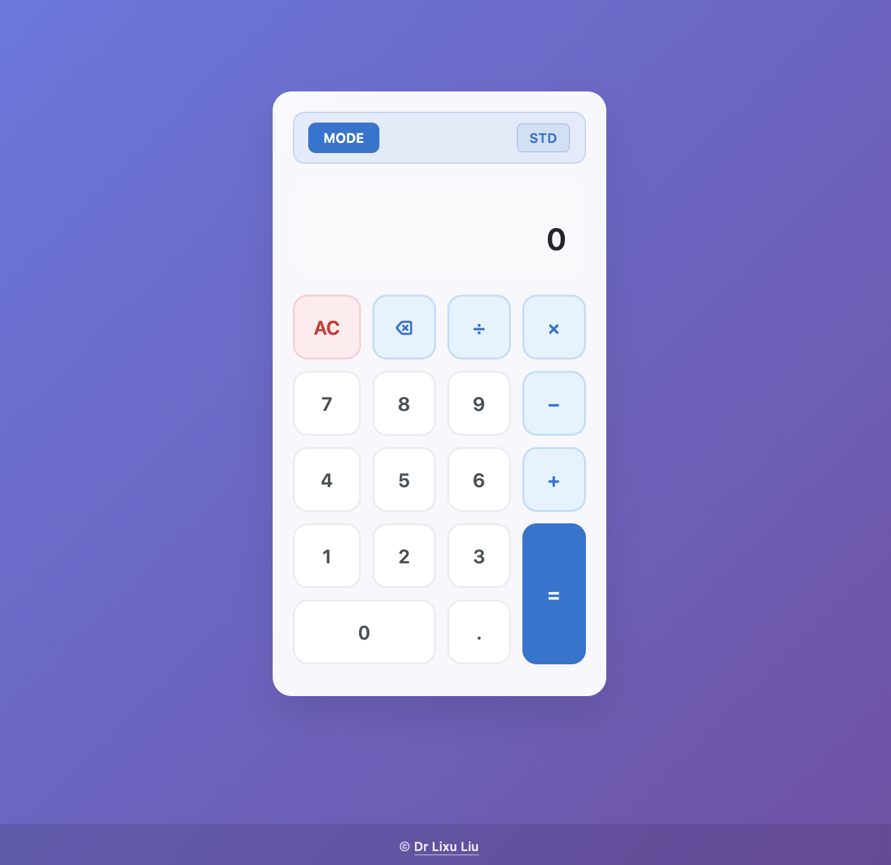

# Simple Calculator

A clean, modern calculator built with HTML, CSS, and JavaScript featuring **Mode Shift** functionality.

**Support the Project** If you find this calculator useful and would like to support its continued development, consider:

[](https://github.com/sponsors/lixuliu) [](https://ko-fi.com/lixuliu)

**GitHub Sponsors** - Support ongoing development and new features  
**Ko-fi** - Buy me a coffee to keep the code flowing ☕

**🌐 Live Demo:** [https://lixuliu.github.io/simple-calculator/](https://lixuliu.github.io/simple-calculator/)



_Modern calculator with glassmorphism design, mode toggle, and professional footer_

## Features

- **Mode Shift**: Toggle between Standard and Scientific modes
- **Standard Mode**: Basic operations - Addition (+), Subtraction (−), Multiplication (×), Division (÷)
- **Scientific Mode**: Advanced functions - Square Root (√), Square (x²), Percent (%), Inverse (1/x)
- **Clear Function**: AC button to reset the calculator
- **Delete Function**: ⌫ button to remove the last digit
- **Decimal Support**: Full decimal number support
- **Keyboard Support**: Use your keyboard for calculations
- **Responsive Design**: Works on both desktop and mobile devices
- **Modern UI**: Clean, glassmorphism design with smooth animations

## How to Use

### Mode Switching

- Click the **MODE** button to toggle between Standard and Scientific modes
- **STD** indicator shows Standard mode (basic operations)
- **SCI** indicator shows Scientific mode (advanced functions)
- Press **M** key to quickly toggle modes

### Mouse/Touch

#### Standard Mode

- Click the number buttons to input numbers
- Click operator buttons (+, −, ×, ÷) to perform calculations
- Click equals (=) to see the result
- Click AC to clear everything
- Click ⌫ to delete the last digit

#### Scientific Mode

- All Standard mode functions plus:
- **√** - Calculate square root of current number
- **x²** - Square the current number
- **%** - Convert current number to percentage (divide by 100)
- **1/x** - Calculate reciprocal of current number

### Keyboard

- **Numbers**: 0-9 keys
- **Decimal**: . key
- **Operators**: +, -, \*, / keys
- **Equals**: Enter or = key
- **Clear**: Escape key
- **Delete**: Backspace key
- **Mode Toggle**: M key

## Getting Started

1. Open `index.html` in your web browser
2. Start calculating!
3. Click MODE to access scientific functions

## Browser Compatibility

- Chrome (recommended)
- Firefox
- Safari
- Edge

## Features in Detail

- **Error Handling**: Division by zero and invalid operations show "Error"
- **Number Formatting**: Large numbers are automatically formatted with commas
- **Operation Chaining**: Perform multiple operations in sequence
- **Responsive Layout**: Adapts to different screen sizes
- **Accessibility**: Proper focus states and keyboard navigation
- **Mode Persistence**: Calculator remembers your mode preference during the session
- **Smooth Transitions**: Beautiful animations when switching modes

## File Structure

```
simple-calculator/
├── index.html      # Main HTML structure with mode toggle
├── styles.css      # CSS styling, animations, and mode-specific styles
├── script.js       # JavaScript calculator logic and mode switching
├── image.png       # Calculator screenshot
└── README.md       # This file
```

## Scientific Functions Examples

- **Square Root**: Enter 16, press √ → Result: 4
- **Square**: Enter 5, press x² → Result: 25
- **Percent**: Enter 50, press % → Result: 0.5
- **Inverse**: Enter 4, press 1/x → Result: 0.25

## Design Features

- **Glassmorphism**: Modern translucent design with backdrop blur
- **Gradient Background**: Beautiful purple-to-blue gradient
- **Responsive Grid**: Clean button layout with proper spacing
- **Professional Footer**: Copyright attribution with clickable link
- **Smooth Animations**: Hover effects and mode transitions

Enjoy your calculations with both Standard and Scientific modes! 🧮✨
